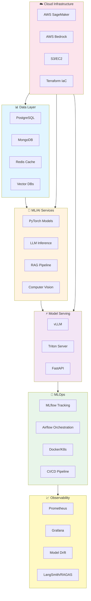
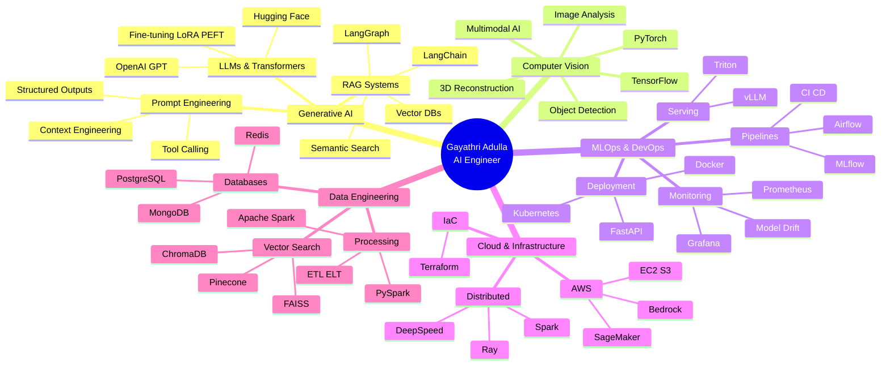

<h3>🚀 AI Engineer specializing in Generative AI, Computer Vision, and Production MLOps</h3>

Building scalable AI systems with PyTorch, LLMs, RAG pipelines, and cloud-native infrastructure

---

## 🎯 Professional Summary

AI Engineer with **3+ years** of production experience developing and deploying machine learning systems, generative AI applications, and MLOps infrastructure. Currently pursuing **M.S. in Artificial Intelligence** at SUNY Buffalo while building enterprise-scale AI solutions at **Cisco Systems**.

**Core Expertise:**
- 🧠 **Generative AI & LLMs**: RAG pipelines, prompt engineering, fine-tuning (LoRA/PEFT), multimodal AI
- 👁️ **Computer Vision**: PyTorch model development, 3D reconstruction, deepfake detection, visual event analysis
- 🔧 **MLOps & Production**: Docker, Kubernetes, CI/CD, model serving (vLLM, Triton), monitoring (MLflow, Prometheus, Grafana)
- ☁️ **Cloud & Infrastructure**: AWS (SageMaker, Bedrock, EC2, S3), Terraform, distributed training, scalable microservices

**Impact Delivered:**
- Improved model accuracy by **18-30%** across network automation and knowledge retrieval systems
- Reduced deployment cycles by **40%** through automated ML/LLM pipelines
- Achieved **98% deepfake detection accuracy** with β-VAE anomaly detection
- Built production CV pipeline with **90% violation detection** across 300K+ parcels

---

## 🏗️ AI System Architecture

---

## 💼 Professional Experience

### 🔹 AI/ML Engineer @ Cisco Systems, USA
**Jan 2026 – Present**

**Generative AI & LLM Systems:**
- Architected production RAG pipelines using **LangChain, LangGraph, Hugging Face Transformers** with semantic search and vector databases, achieving **30% improvement** in contextual response accuracy
- Developed MCP-based integrations connecting LLMs with enterprise tools for tool calling and workflow automation
- Implemented LLM evaluation framework using **RAGAS, LangSmith, TruLens** for quality monitoring and retrieval performance

**Computer Vision & Multimodal AI:**
- Built multimodal AI applications using **PyTorch** with fine-tuning techniques (LoRA, PEFT) for image analysis, increasing inference accuracy by **20%**
- Optimized model serving with **vLLM** and **Triton Inference Server** for production workloads

**MLOps & Production Infrastructure:**
- Engineered end-to-end ML/LLM pipelines using **MLflow, Airflow, Docker, Kubernetes, GitHub Actions**, reducing release cycles by **40%**
- Developed scalable AI microservices with **FastAPI, Redis, AWS (SageMaker, Bedrock)** using Terraform IaC
- Implemented comprehensive observability with **Prometheus, Grafana** for latency, drift, and service reliability monitoring

**Machine Learning & Optimization:**
- Developed predictive models using **PyTorch, TensorFlow, SQL**, improving accuracy by **18%** for network automation
- Optimized large-scale data processing with **Apache Spark, PostgreSQL**, reducing training time by **25%**

**AI Security & Responsible AI:**
- Implemented guardrails, prompt-injection mitigation, access controls, and data protection across production services

**Technologies:** Python, PyTorch, TensorFlow, LangChain, LangGraph, Hugging Face, RAG, LoRA, PEFT, vLLM, Triton, MLflow, Airflow, Docker, Kubernetes, FastAPI, Redis, AWS (SageMaker, Bedrock, S3, EC2), Terraform, Prometheus, Grafana, RAGAS, LangSmith, Apache Spark, PostgreSQL, MCP

---

### 🔹 Machine Learning Engineer @ Hexaware Technologies, India
**Jul 2022 – Jun 2024**

**Machine Learning Development:**
- Developed predictive ML models using **Python, TensorFlow, PyTorch, Scikit-learn, SQL**, improving forecasting accuracy by **17%**
- Optimized production models through feature engineering, hyperparameter tuning, and inference optimization, increasing accuracy by **15%**

**Data Engineering & Pipelines:**
- Built ETL and feature engineering pipelines using **Apache Spark, PySpark, PostgreSQL**, reducing data preparation effort by **45%**

**MLOps & Deployment:**
- Deployed ML services using **FastAPI, Docker, AWS** with CI/CD, reducing deployment time by **30%**
- Implemented **MLflow, Airflow** workflows for experiment tracking, model versioning, and automated deployment
- Built scalable ML microservices using **FastAPI, Docker, Kubernetes, Redis** for concurrent inference workloads

**Monitoring & Reliability:**
- Implemented model monitoring with **MLflow, Prometheus, Grafana** tracking performance, latency, and drift, maintaining **95%+ stability**
- Applied ML testing, data validation, and security practices using **Pytest, Git, Docker, AWS**

**Technologies:** Python, TensorFlow, PyTorch, Scikit-learn, SQL, Apache Spark, PySpark, PostgreSQL, FastAPI, Docker, Kubernetes, Redis, AWS, MLflow, Airflow, Prometheus, Grafana, Pytest, Git, CI/CD

---

## 🎓 Education

### 🎓 Master of Science in Artificial Intelligence
**State University of New York at Buffalo** | Jan 2025 – May 2026

### 🎓 Bachelor of Technology in Artificial Intelligence
**Mahindra University, Telangana, India** | Aug 2020 – May 2024

---

## 🧠 Technical Expertise Ecosystem

---

## 🛠️ Technology Stack

### 💻 Programming Languages

### 🤖 AI/ML Frameworks

### 🔧 MLOps & DevOps

### ☁️ Cloud Platforms

### 📊 Databases & Data

### 🔍 Monitoring & Observability
![Prometheus](https://img.shields.io/badge/Prometheus-E